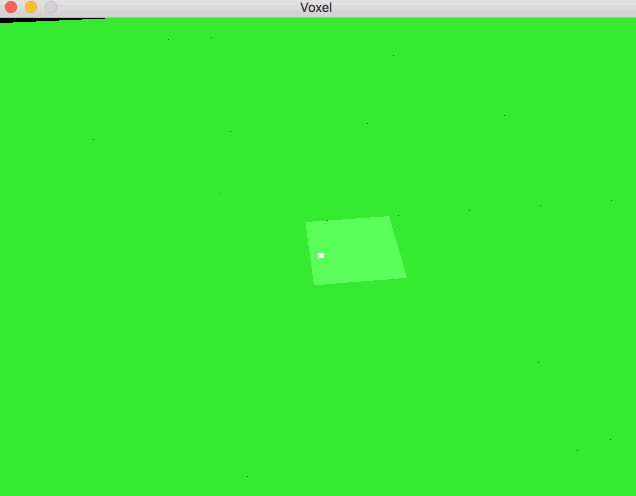

# Voxel
A high-powered OpenGL voxel engine, almost suitable for miners.

Voxel's build script is currently setup to build on OSX El Capitan.

* Requires SDL2, SDL2_image, and glm

# Controls

* left click to remove a block, right click to add
* WASD to fly the camera around

